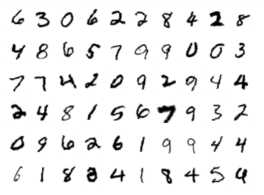
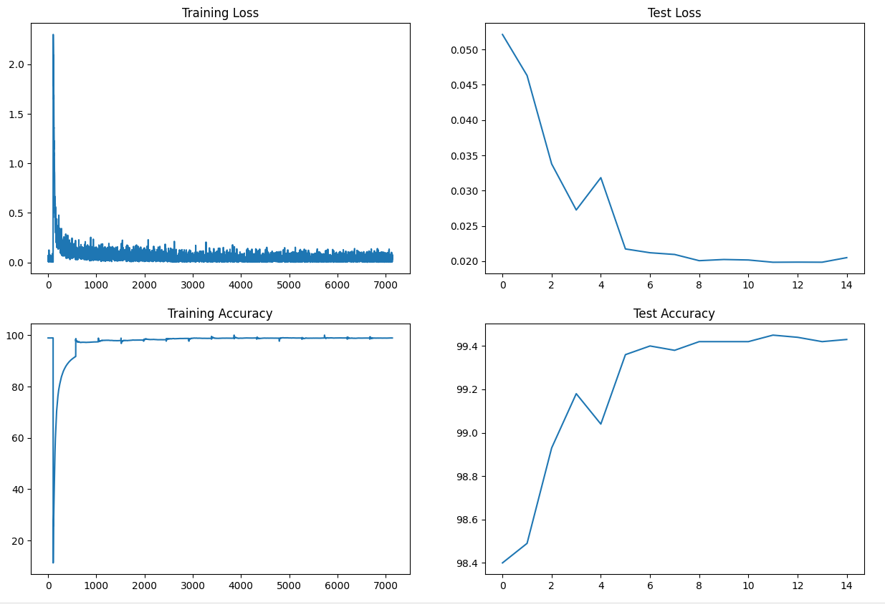

# S7 - Neural Network Image Classification - MNIST DataSet

## Description

This project includes three Python files: `model.py`, `utils.py`, `S7_model_structure_skeleton.ipynb', 'S7_model_reduce_capacity_regularize.ipynb', and 'S7_model_ImgAug_LR.ipynb'. These files are part of a machine learning project for image classification using the MNIST dataset. The project is about training a neural network model to recognize handwritten digits using less than 8K parameters, and with test accuracy equal to or greater than 99.4% in less than 15 epochs.

Few samples in the dataset are shown below.




## Files

### 1. model.py

This file provides the neural network model architecture for image classification. This file consists of 6 classes pertaining to 6 different network architectures - 'Model_1', 'Model_2', 'Model_3', 'Model_4', 'Model_5' and 'Model_9". All of these are subclasses of `torch.nn.Module` and consists of several convolution layers. These network architectures are incremental architectures meant to develop the desired model from scratch with a skeleton architecture, then reduce the model capacity to fit in the 8K parameter criteria, and then bring up model effectiveness with batch normalization, regularization and drop out. The `forward` method implements the forward pass of the model, and the `summary` method provides a summary of the model's architecture. The following shows model summary for 'Model_9' architecture (parameter count = 7.280K) which meets the parameter criteria.

```
----------------------------------------------------------------
        Layer (type)               Output Shape         Param #
================================================================
            Conv2d-1            [-1, 8, 26, 26]              72
              ReLU-2            [-1, 8, 26, 26]               0
       BatchNorm2d-3            [-1, 8, 26, 26]              16
           Dropout-4            [-1, 8, 26, 26]               0
            Conv2d-5           [-1, 16, 24, 24]           1,152
              ReLU-6           [-1, 16, 24, 24]               0
       BatchNorm2d-7           [-1, 16, 24, 24]              32
           Dropout-8           [-1, 16, 24, 24]               0
            Conv2d-9           [-1, 10, 24, 24]             160
        MaxPool2d-10           [-1, 10, 12, 12]               0
           Conv2d-11           [-1, 14, 10, 10]           1,260
             ReLU-12           [-1, 14, 10, 10]               0
      BatchNorm2d-13           [-1, 14, 10, 10]              28
          Dropout-14           [-1, 14, 10, 10]               0
           Conv2d-15             [-1, 16, 8, 8]           2,016
             ReLU-16             [-1, 16, 8, 8]               0
      BatchNorm2d-17             [-1, 16, 8, 8]              32
          Dropout-18             [-1, 16, 8, 8]               0
           Conv2d-19              [-1, 8, 6, 6]           1,152
             ReLU-20              [-1, 8, 6, 6]               0
      BatchNorm2d-21              [-1, 8, 6, 6]              16
          Dropout-22              [-1, 8, 6, 6]               0
           Conv2d-23             [-1, 16, 6, 6]           1,152
             ReLU-24             [-1, 16, 6, 6]               0
      BatchNorm2d-25             [-1, 16, 6, 6]              32
          Dropout-26             [-1, 16, 6, 6]               0
        AvgPool2d-27             [-1, 16, 1, 1]               0
           Conv2d-28             [-1, 10, 1, 1]             160
================================================================
Total params: 7,280
Trainable params: 7,280
Non-trainable params: 0
----------------------------------------------------------------
Input size (MB): 0.00
Forward/backward pass size (MB): 0.60
Params size (MB): 0.03
Estimated Total Size (MB): 0.63
----------------------------------------------------------------
```
This file also has train and test functions which return the train loss, train accuracy, test loss and test accuracy respectively. 
This file also has new code logic comprised in a function get_incorrect_test_predictions to obtain the samples of mis-classifications.


### 2. utils.py

The `utils.py` file contains helper functions that are used throughout the project. These functions provide some common functionalities for data preprocessing, visualization, or any other necessary operations. It includes functions for plotting the model train / test loss/accuracy statistics (function: display_model_stats), displaying the train data images (function: display_train_data), display images by index (function: show_image_by_index), show multiple images (function: display_multiple_images), ploting the test incorrect classification predictions (function: plot_test_incorrect_predictions).

### 3. S7_model_structure_skeleton.ipynb

The `S7_model_structure_skeleton.ipynb` file is the notebook that has executions of training models based on the network architectures Model_1 and Model_2 so as to create a structure to the model and then build a basic skeleton model which is further used to develop the final model. 

### 4. S7_model_reduce_capacity_regularize.ipynb

The `S7_model_reduce_capacity_regularize.ipynb` file is the notebook that has executions of training models based on the network architectures Model_4 and Model_5 so as to reduce the capapcity of the initial models and then apply the much needed Batch normalization, drop out and regularization to improve the effectiveness of the model with reduced parameter capacity. 

### 5. S7_model_ImgAug_LR.ipynb

The `S7_model_ImgAug_LR.ipynb` file is the notebook that has executions of training models based on the network architectures Model_9 after performing image augmentation of the data. Further to improve the model performance and its consistency, model is trained with ReduceLROnPlateau. This is to let the model change learning rates based on the loss change observed in test (ideally validation) data. This notebook has model satisfying the project criteria of consistent 99.4 accuracy. 


The above 3 ipynb files contain code for training and evaluating a neural network model using the MNIST dataset. These files include the following components:

- Importing necessary libraries and dependencies
- Mounting Google Drive
- Setting up the device (CPU or GPU)
- Defining data transformations for training and testing
- Loading the MNIST dataset
- Setting up data loaders
- Displaying sample data from the training set
- Defining the neural network model and displaying its summary
- Training the model using SGD optimizer and NLL loss
- Displaying model training and testing statistics
- Plotting incorrect test predictions
- Defining an alternative neural network model (Model_1 to Model_9) and displaying its summary

In addition to the above components, each of these notebooks contain "Target-Results-Analysis" section for each of the models tried towards the end of the notebooks.

Please note that this README is dynamically generated and serves as a placeholder. As you make further modifications to the project, remember to update this file accordingly. Provide a brief description of each file, its purpose, and its relevance to the project's functionality.

For more detailed information on the project's implementation and code, please refer to the individual files mentioned above.

## Usage

To run the project, make sure you have the dependencies installed.
```
pip install -r requirements.txt
```
You can execute the `S5.ipynb` notebook to perform the training and testing. Adjust the hyperparameters such as learning rate, momentum, batch size, and number of epochs to improve the model performance as desired.

Below are few results provided by utils functions for the final model that gave consistent accuracy of 99.4% at the respective place in S7_model_ImgAug_LR.ipynb notebook.

### 1. Final Best Model Training and Test Statistics

```
display_model_stats(train_loss, train_accuracy, test_loss, test_accuracy)
```



